# TorqueEd - Automotive Education CMS

A comprehensive school management system designed specifically for automotive education programs, built with KeystoneJS 6.

## 📋 Key Documentation

### 🎯 [Product Requirements Document (PRD)](/docs/torque-ed-prd.md)
Complete business requirements, user stories, and feature specifications for the TorqueEd automotive education CMS.

### 🔧 [Technical Specification](/docs/torque-ed-tech-spec.md)
Detailed technical implementation guide, architecture decisions, and development roadmap.

## Quick Start

### Prerequisites
- Node.js 20.x LTS
- PostgreSQL 15+
- npm (comes with Node.js)

### Installation

1. **Install dependencies**
   ```bash
   npm install
   ```

2. **Set up environment variables**
   ```bash
   cp .env.example .env
   ```
   Edit `.env` and update the database connection string and session secret.

3. **Set up PostgreSQL database**
   
   **Option A: Using Docker (Recommended for development)**
   ```bash
   # Start PostgreSQL in Docker
   docker-compose -f docker-compose.dev.yml up -d postgres
   
   # Wait for database to be ready
   docker-compose -f docker-compose.dev.yml logs postgres
   ```
   
   **Option B: Using local PostgreSQL installation**
   ```bash
   # If you have createdb command available
   createdb torqueed_dev
   
   # Or using psql directly
   psql -U postgres -c "CREATE DATABASE torqueed_dev;"
   
   # Update .env with your local PostgreSQL credentials
   ```

4. **Run database migrations**
   ```bash
   npm run prisma migrate dev
   ```

5. **Seed the database (optional)**
   ```bash
   npm run seed
   ```

6. **Start the development server**
   ```bash
   npm run dev
   ```

7. **Access the application**
   - Open http://localhost:3030
   - Create your first admin user when prompted
   - The user will automatically have `superAdmin` role

## Project Structure

```
torque-ed/
├── docs/                    # Project documentation
├── schema/                  # KeystoneJS data models
│   ├── index.ts            # Schema exports
│   ├── User.ts             # User management
│   ├── SchoolSystem.ts     # Multi-tenant organization
│   ├── School.ts           # Individual schools
│   ├── Course.ts           # Course definitions
│   ├── Semester.ts         # Academic terms
│   ├── Holiday.ts          # Calendar management
│   ├── Class.ts            # Class instances
│   ├── Student.ts          # Student records
│   ├── Enrollment.ts       # Class enrollment
│   ├── ClassMeeting.ts     # Individual class sessions
│   └── AttendanceRecord.ts # Attendance tracking
├── keystone.ts             # Main configuration
├── seed.ts                 # Database seeding
└── package.json
```

## Quick Links

- **Admin Dashboard**: http://localhost:3030
- **Attendance Spreadsheet**: http://localhost:3030/attendance
- **GraphQL Playground**: http://localhost:3030/api/graphql

## Key Features

### Phase A (Current Implementation)
- **Multi-tenant Architecture**: Complete isolation between school systems
- **Role-based Access Control**: Super Admin, Admin, Instructor, and TA roles
- **Course Management**: Create and manage automotive courses
- **Class Scheduling**: Automatic meeting generation with holiday handling
- **Student Management**: QR code generation for attendance tracking
- **Attendance System**: Ready for QR scanner integration

### User Roles
- **Super Admin**: Full system access, manages school systems
- **Admin**: School and course management within their system
- **Instructor**: Class roster and attendance management
- **Teaching Assistant**: Attendance tracking only

## Database Schema

The system uses a hierarchical structure:
```
School System → Schools → Courses → Classes → Students (via Enrollments)
```

Key relationships:
- Students have unique QR codes for attendance scanning
- Classes automatically generate meetings based on schedule
- Multi-role support (users can be TAs in some classes, students in others)

## Development

### Available Scripts
- `npm run dev` - Start development server with hot reload
- `npm run build` - Build for production
- `npm start` - Start production server
- `npm run prisma` - Access Prisma CLI through Keystone
- `npm run seed` - Seed database with sample data

### GraphQL API
KeystoneJS automatically generates a GraphQL API available at:
- **GraphQL Playground**: http://localhost:3030/api/graphql
- **Admin UI**: http://localhost:3030

### Database Operations
```bash
# Create and apply migration
npm run prisma migrate dev

# Reset database
npm run prisma migrate reset

# View database in Prisma Studio
npm run prisma studio
```

## Next Steps

### Phase B: Grading System
- Grade entry and calculation
- Progress tracking through curriculum
- Grade spreadsheet generation

### Phase C: Coursework Tracking
- Integration with curriculum systems
- Video submission for lab work
- MongoDB storage for flexible curriculum data

## Support

For questions or issues, contact Rich Goldman at rich@comfypants.org

## 📚 Additional Documentation

- **[System Architecture](/docs/ARCHITECTURE.md)** - Detailed system design and implementation patterns
- **[API Specification](/docs/API_SPEC.md)** - Complete GraphQL/REST API documentation
- **[Domain Model](/docs/DOMAIN_MODEL.md)** - Business logic, rules, and terminology
- **[Deployment Guide](/docs/DEPLOYMENT.md)** - Infrastructure and deployment procedures
- **[AI Assistant Instructions](/docs/CLAUDE.md)** - Development guidelines and project context

## 📸 System Screenshots

The following screenshots show the key features and interfaces of TorqueEd, organized from general administration to specific attendance tracking:

### System Administration
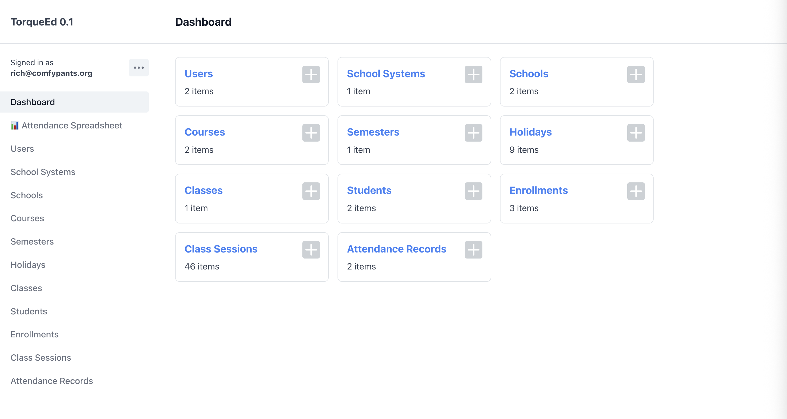
*Main dashboard showing system overview*

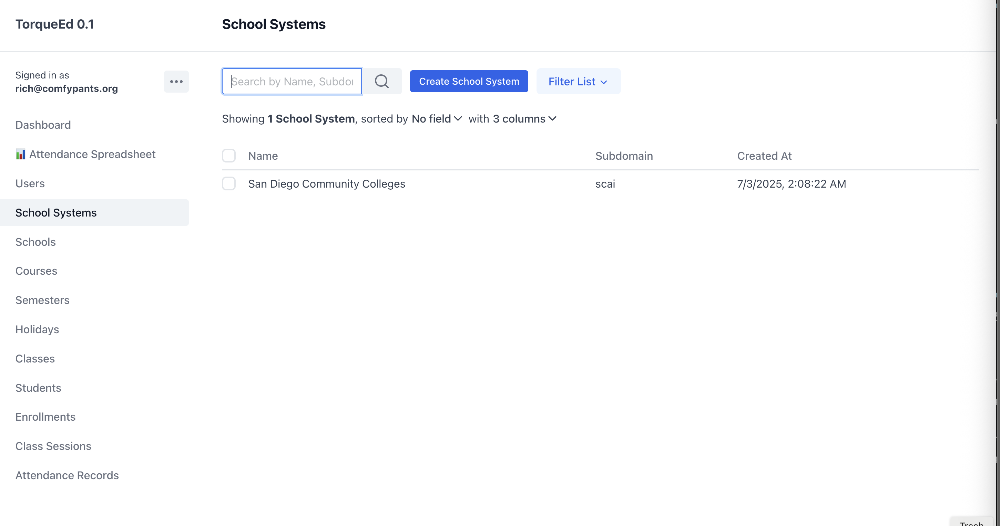
*Multi-tenant school system management*

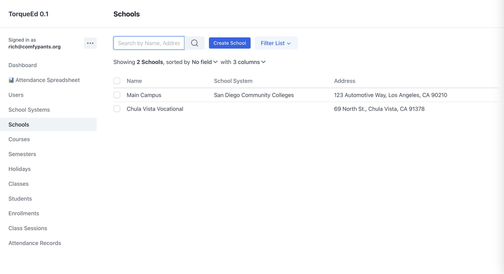
*Individual school management within a system*

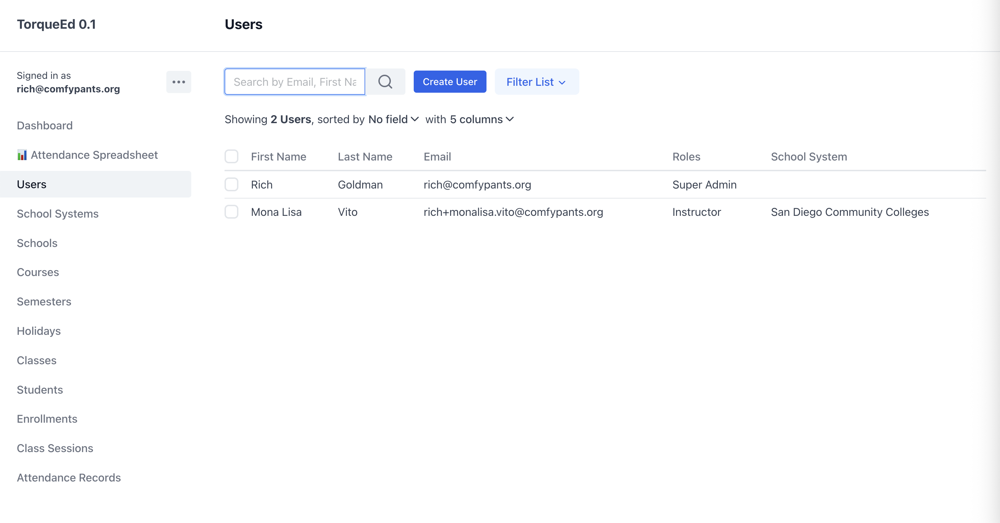
*User management with role-based access control*

### Academic Management
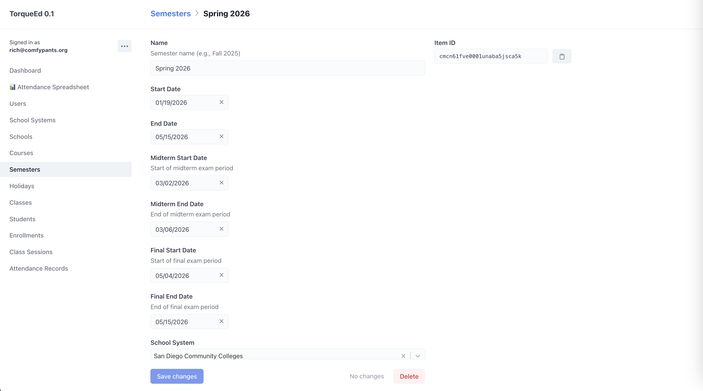
*Academic term management with midterm/final periods*

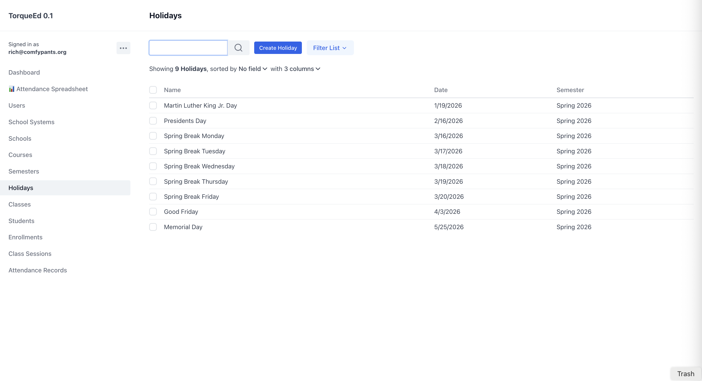
*Holiday calendar management for session generation*

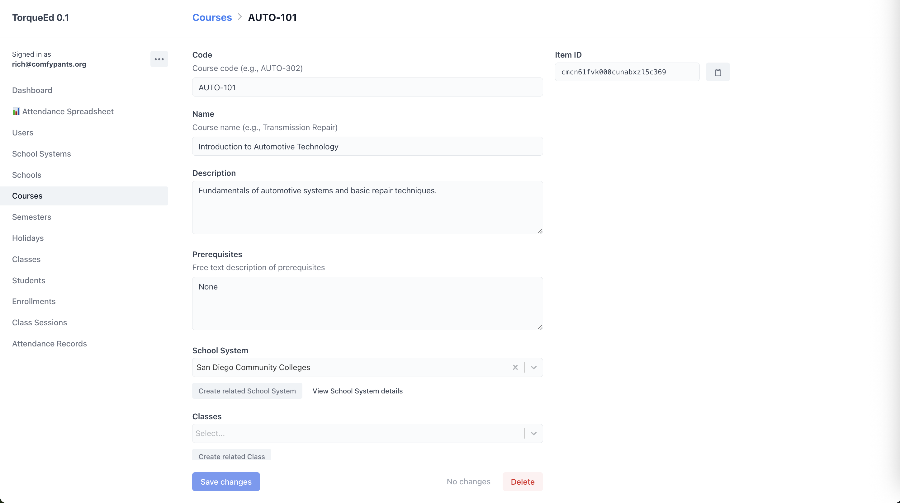
*Course catalog management*

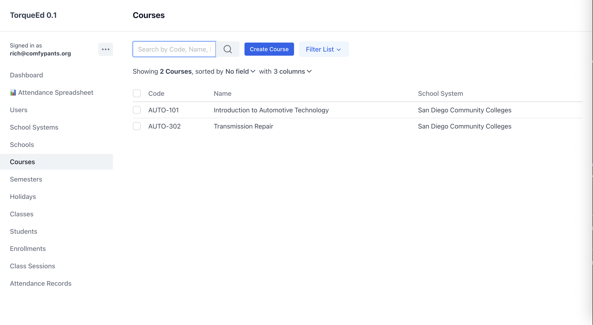
*Detailed course information and settings*

### Class Management
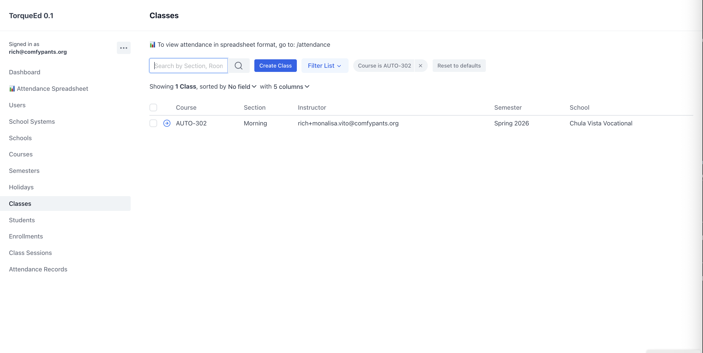
*Class instance management with scheduling*

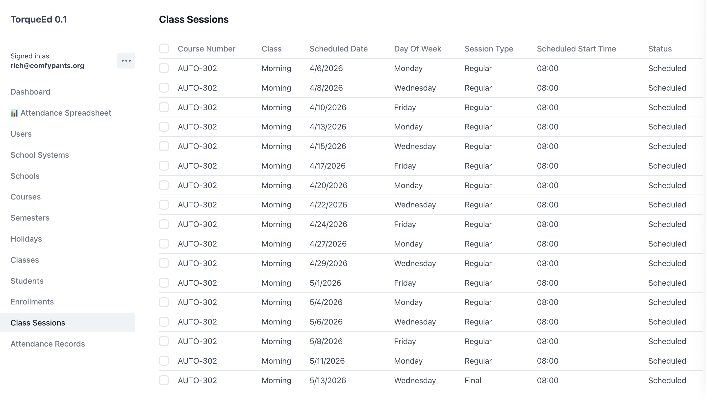
*Individual class session management with auto-generation*

### Student Management
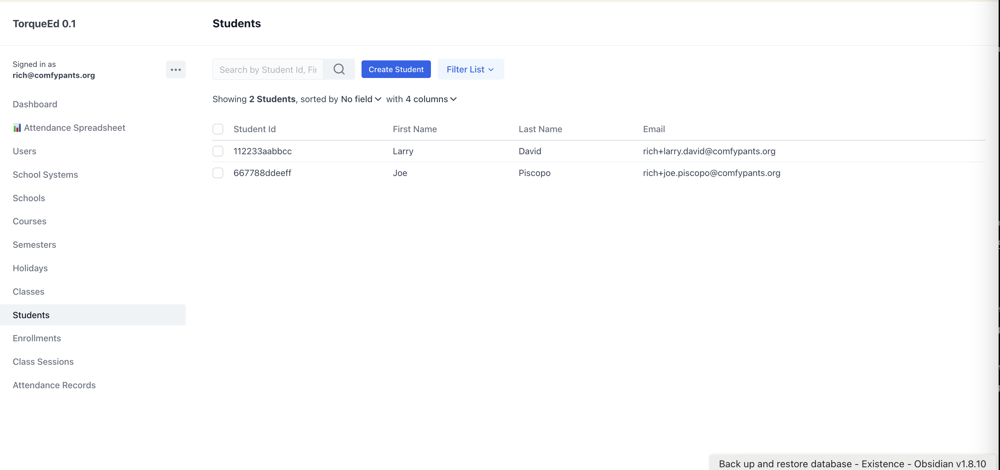
*Student records with QR code generation*

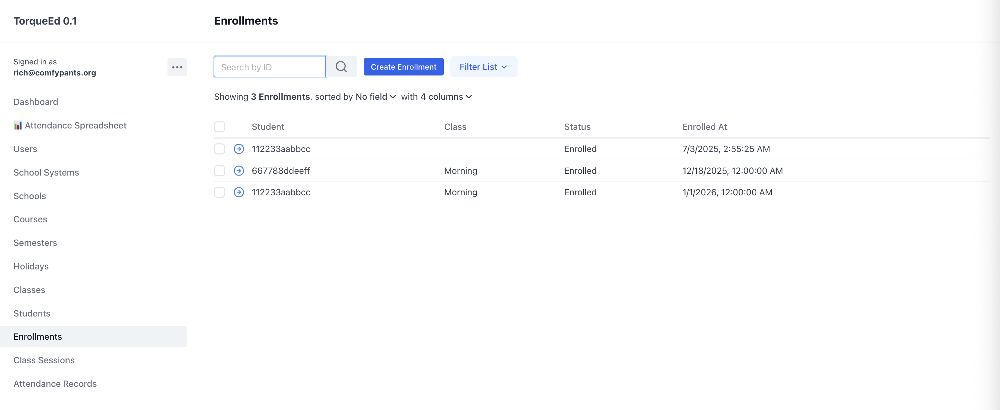
*Class enrollment management*

### Attendance Tracking
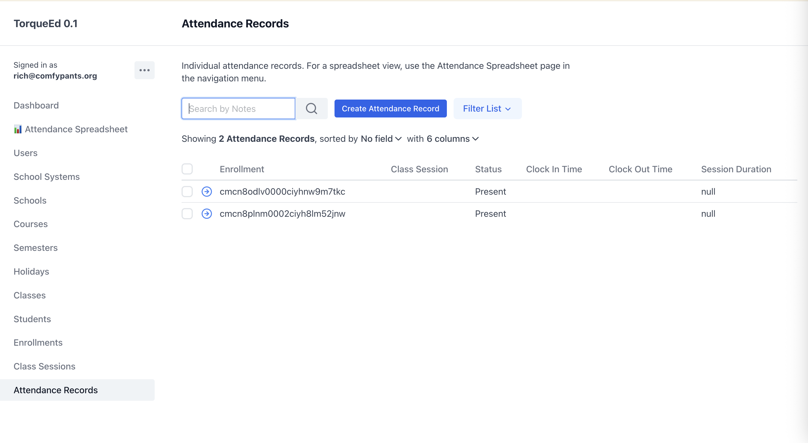
*Individual attendance record management*

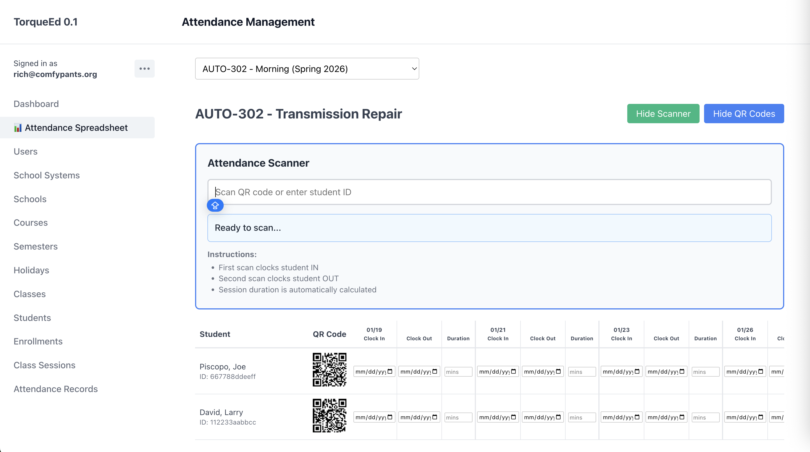
*Comprehensive attendance spreadsheet with clock-in/clock-out tracking*

## License

Proprietary - All rights reserved